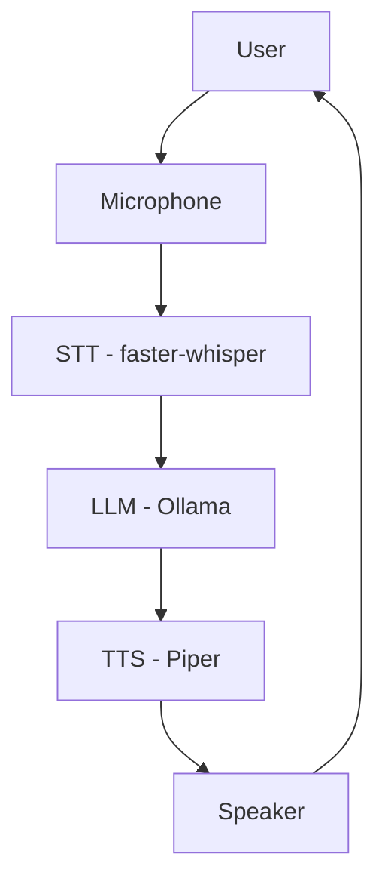

# AI Assistant

A local, offline-first **voice AI assistant base** (STT → LLM → TTS) built in
Python, designed to be the common foundation for student robotics projects.

---

## 1. Overview

This repository provides a small, reliable voice pipeline: it listens
through a microphone, transcribes speech, generates a reply with a local
language model, and speaks the reply back out loud — all running locally,
with no cloud dependency.

It is intentionally kept **simple**. There is no framework, no
microservices, no database. Three independent Python modules
(`stt.py`, `llm.py`, `tts.py`) do one job each, and `assistant.py` wires them
together. This simplicity is a feature, not an oversight: it's what makes
the project easy to understand, easy to test, and easy to fork for a new
robot.

## 2. Project Goal

This repository is meant to become the **shared AI assistant base** for
every voice-enabled robotics project built by the team, rather than each
project reinventing STT/LLM/TTS plumbing from scratch.

Concretely, the goals are:

- One well-tested, well-documented pipeline that every project starts from.
- A codebase simple enough that a new student can read all of it.
- A clear separation between "base infrastructure" (this repo) and
  "project-specific behavior" (prompt, skills, hardware — see
  [Section 12](#12-creating-a-new-robotics-assistant)).

## 3. Features

- 🎙️ **Local speech-to-text** via [faster-whisper](https://github.com/SYSTRAN/faster-whisper), with adaptive voice-activity detection (webrtcvad) so it starts/stops recording on its own.
- 🧠 **Local LLM conversation** via [Ollama](https://ollama.com) (default model: `qwen2.5:3b`), with short conversation memory and a configurable system prompt.
- 🔊 **Local text-to-speech** via [Piper](https://github.com/rhasspy/piper), a fast, natural-sounding, CPU-friendly voice engine.
- 🗣️ Voice "stop" command (`"stop"` / `"arrêt"`) to end the conversation hands-free.
- 🛡️ Defensive error handling at every stage — a missing model, a dead
  microphone, or an unreachable LLM server never crashes the assistant; it
  degrades gracefully and keeps listening.
- 🧪 40 automated unit tests with mocked hardware/network dependencies, so
  the whole pipeline's logic can be verified without a microphone, speaker,
  or GPU.
- ⚙️ Centralized, environment-variable-friendly configuration (`config.py`).
- French by default (system prompt, STT/TTS language), fully configurable.

## 4. Architecture



Everything runs **locally** on the machine (PC or Raspberry Pi) — no audio
or text ever leaves the device, except the STT/TTS model *download* the
first time you set things up.

## 5. How the Assistant Works

The core loop lives in `assistant.py` and repeats these steps until a stop
command or `Ctrl+C`:

1. **Listen** — `stt.py` opens the microphone, uses `webrtcvad` to detect
   when speech starts and stops, and transcribes the recorded audio to text
   with `faster-whisper`.
2. **Check for a stop command** — if the recognized text matches a
   configured stop word (`stop`, `arrêt`, ...), the assistant says goodbye
   and exits.
3. **Think** — `llm.py` sends the transcribed text (plus the system prompt
   and recent conversation history) to a local Ollama server and gets back
   a short, spoken-style reply.
4. **Speak** — `tts.py` synthesizes the reply with Piper and plays it
   through the speaker.
5. Any error at any stage (STT, LLM, or TTS) is logged and announced with a
   short apology message — the loop never crashes, it just keeps going.

### Concrete example

```text
User:
"Bonjour, qu'est-ce que tu peux faire ?"

        ↓ microphone

STT (faster-whisper)
        ↓
Text: "Bonjour, qu'est-ce que tu peux faire ?"

        ↓

LLM (Ollama / qwen2.5:3b)
        ↓
Generated reply: "Bonjour ! Je peux répondre à vos questions et vous
orienter. Que puis-je faire pour vous ?"

        ↓

TTS (Piper)
        ↓ speaker

User hears the reply
```

## 6. Repository Structure

```text
ai-assitant/
├── README.md                 <- you are here
├── requirements.txt           <- Python dependencies
├── .gitignore                 <- excludes models, logs, temp audio, venvs...
└── src/
    ├── assistant.py            <- orchestration: STT -> LLM -> TTS loop
    ├── stt.py                  <- speech-to-text (faster-whisper + webrtcvad)
    ├── llm.py                  <- conversation with the local LLM (Ollama)
    ├── tts.py                  <- text-to-speech (Piper)
    ├── config.py                <- all configuration in one place
    ├── models/
    │   ├── README.md             <- where models go & how to get them
    │   ├── fr_FR-siwis-medium.onnx.json  <- Piper voice config (tracked)
    │   ├── fr_FR-siwis-medium.onnx        <- Piper voice weights (you download this, not tracked)
    │   └── whisper/               <- faster-whisper cache (auto-downloaded, not tracked)
    └── tests/
        ├── test_assistant.py       <- orchestration logic (mocked engines)
        ├── test_stt.py              <- STT engine (mocked mic/model)
        ├── test_llm.py              <- LLM engine (mocked Ollama client)
        └── test_tts.py              <- TTS engine (mocked Piper/player)
```

Module responsibilities, in one line each:

| File            | Responsibility                                             |
|------------------|--------------------------------------------------------------|
| `assistant.py`  | Main orchestration loop; never re-implements STT/LLM/TTS logic |
| `stt.py`        | Microphone capture, voice-activity detection, transcription  |
| `llm.py`        | Talks to Ollama, keeps short conversation memory              |
| `tts.py`        | Synthesizes speech and plays it through the speaker           |
| `config.py`     | Central configuration for every module                       |
| `tests/`        | Automated tests, one file per module                          |

Each module also has a `python <module>.py` manual test mode at the bottom
of the file for quick interactive checks (see [Section 8](#8-installation)).

## 7. Requirements

### Software

- Python 3.10+ (developed/tested on 3.12)
- [Ollama](https://ollama.com) installed and running locally
- System audio tools: `libportaudio2` (microphone capture) and either
  `alsa-utils` (`aplay`) or `pulseaudio-utils` (`paplay`) for playback

### Hardware

- A working microphone and speaker (or the Raspberry Pi/robot's audio setup)
- Minimum ~2 GB RAM free for the `small` Whisper model + `qwen2.5:3b` +
  Piper running together; more headroom is safer on a Raspberry Pi 4/5.
- No GPU required — everything defaults to CPU-friendly settings.

## 8. Installation

```bash
# 1. Clone the repository
git clone https://github.com/zaagrami-byte/ai-assitant.git
cd ai-assitant

# 2. Create and activate a virtual environment
python3 -m venv venv
source venv/bin/activate            # Windows: venv\Scripts\activate

# 3. Install system audio dependencies (Debian/Ubuntu/Raspberry Pi OS)
sudo apt update
sudo apt install -y libportaudio2 alsa-utils

# 4. Install Python dependencies
pip install -r requirements.txt

# 5. Install Ollama and pull the default model
#    (see https://ollama.com for install instructions)
ollama pull qwen2.5:3b

# 6. Download the Piper voice model (see Section 9.3 / src/models/README.md)
cd src/models
curl -L -o fr_FR-siwis-medium.onnx \
  "https://huggingface.co/rhasspy/piper-voices/resolve/main/fr/fr_FR/siwis/medium/fr_FR-siwis-medium.onnx"
cd ../..
```

The faster-whisper STT model does **not** need a manual download step — it
downloads automatically the first time you run the assistant (see
[Section 9.2](#92-stt--faster-whisper)).

## 9. AI Models

Full details, file locations, and configuration variables are documented in
[`src/models/README.md`](src/models/README.md). Summary:

### 9.1 LLM

- Engine: [Ollama](https://ollama.com), running as a local server.
- Default model: `qwen2.5:3b` (good balance of quality/speed/RAM for a
  Raspberry Pi 4).
- Install with `ollama pull qwen2.5:3b`; change via the `LLM_MODEL`
  environment variable or `config.py`.
- Nothing to place manually — Ollama manages its own model storage.

### 9.2 STT — faster-whisper

- Engine: [faster-whisper](https://github.com/SYSTRAN/faster-whisper)
  (Whisper + CTranslate2, int8 quantization).
- Default size: `small`. Downloads and caches itself automatically into
  `src/models/whisper/` on first use — requires internet the first time
  only.
- Change size/device via `STT_MODEL` / `STT_DEVICE` / `STT_COMPUTE_TYPE`.

### 9.3 TTS — Piper

- Engine: [Piper](https://github.com/rhasspy/piper) (ONNX, CPU, low
  latency).
- Default voice: `fr_FR-siwis-medium`. The `.onnx.json` config for this
  voice ships in the repo; the `.onnx` weights file (~60 MB) must be
  downloaded once — see [Section 8](#8-installation) or
  `src/models/README.md`.
- Change voice via `TTS_VOICE_NAME`; both files must sit in
  `src/models/`.

## 10. Configuration

All configuration lives in **`src/config.py`**. Every setting can be
overridden with an environment variable of the same name, without touching
the file — useful for running the same code on a dev laptop and on a robot
with different hardware.

Main groups of settings:

| Group          | Examples                                               |
|-----------------|----------------------------------------------------------|
| Ollama / LLM   | `OLLAMA_HOST`, `LLM_MODEL`, `LLM_TIMEOUT`, `MAX_HISTORY`  |
| System prompt  | `SYSTEM_PROMPT` — the assistant's personality/rules       |
| TTS (Piper)    | `TTS_MODELS_DIR`, `TTS_VOICE_NAME`, `TTS_PLAYER_CMD`      |
| STT (Whisper)  | `STT_MODEL`, `STT_DEVICE`, `STT_LANGUAGE`, `STT_MODEL_DIR`|
| STT (VAD)      | `STT_VAD_MODE`, `STT_VAD_START_RATIO`, `STT_VAD_END_RATIO`|
| Assistant      | `ASSISTANT_STOP_WORDS`, `ASSISTANT_ERROR_MESSAGE`         |
| Logging        | `LOG_LEVEL`, `LOG_DIR`, `LOG_FILE`                        |

Example: run against a different Ollama model without editing any file:

```bash
LLM_MODEL=llama3.2:3b python src/assistant.py
```

**What you'll typically change per project:** `SYSTEM_PROMPT`, `LLM_MODEL`,
`STT_LANGUAGE`, `TTS_VOICE_NAME`, `ASSISTANT_STOP_WORDS`.
**What you should rarely need to touch:** the VAD tuning values and the
faster-whisper anti-hallucination thresholds — they were tuned to work
reliably in a noisy room and changing them can reintroduce false starts or
Whisper hallucinations. If you must, change one at a time and re-test.

## 11. Running the Assistant

```bash
cd src
python assistant.py
```

You should see:

```text
Assistant demarre. Parlez a tout moment (dites 'stop' pour arreter).

Ecoute...
```

Speak a short sentence, pause naturally, and the assistant will transcribe
it, think, and reply out loud. Say **"stop"** or **"arrêt"** (or press
`Ctrl+C`) to end the conversation.

Each module can also be run and tested on its own:

```bash
cd src
python stt.py     # interactive mic test: press Enter, speak, see the transcript
python llm.py     # sends a few sample questions to the LLM and prints replies
python tts.py     # synthesizes and plays a few sample sentences
```

## 12. Testing

The test suite mocks every piece of hardware and network access (no
microphone, speaker, or running Ollama server needed for the default run).

```bash
cd src
python -m unittest discover -v
```

Run a single module's tests:

```bash
python -m unittest tests.test_llm -v
```

A handful of tests are **integration tests** — they need real hardware
(microphone/speaker) and a running Ollama server, and are skipped by
default. Enable them explicitly when you have that hardware available:

```bash
RUN_INTEGRATION=1 python -m unittest discover -v
```

| Module           | What's covered                                                    |
|-------------------|----------------------------------------------------------------------|
| `test_stt.py`    | Empty audio, missing microphone/`webrtcvad`, model load failure, VAD start/stop logic, timeouts, cleanup of temp files |
| `test_llm.py`    | Empty input, Ollama unreachable, model not found, empty response, conversation history trimming |
| `test_tts.py`    | Empty text, missing Piper model files, no audio player available, explicit player override |
| `test_assistant.py` | Full turn orchestration, stop-word detection, graceful handling of STT/LLM/TTS errors |

When adding a new feature, add a mocked test for it alongside the existing
ones rather than introducing a new testing framework or style.

## 13. Troubleshooting

| Problem | Cause | Solution |
|---|---|---|
| `LLMUnavailableError: Ollama est injoignable` | Ollama isn't running, or `OLLAMA_HOST` points to the wrong address | Run `ollama serve` (or check the systemd service), verify `OLLAMA_HOST` |
| `LLMModelNotFoundError` | The model in `LLM_MODEL` isn't pulled locally | `ollama pull qwen2.5:3b` (or your configured model) |
| `TTSModelNotFoundError` | Piper `.onnx`/`.onnx.json` missing from `src/models/` | Download the voice files — see [Section 9.3](#93-tts--piper) |
| `STTModelError` on first run | No internet access to download the Whisper model | Connect to internet once, or pre-download `src/models/whisper/` on another machine and copy it over |
| `STTMicrophoneError: sounddevice/PortAudio indisponible` | `libportaudio2` system library missing | `sudo apt install libportaudio2` |
| `STTMicrophoneError: webrtcvad n'est pas installe` | `webrtcvad` Python package missing | `pip install -r requirements.txt` (make sure you're on an up-to-date `requirements.txt`) |
| `TTSPlaybackError: Aucun lecteur audio trouve` | Neither `aplay` nor `paplay` is installed | `sudo apt install alsa-utils` (or `pulseaudio-utils`) |
| No sound / wrong output device | Wrong default audio device on Linux | `aplay -l` / `pactl list sinks` to list devices, set the system default |
| `PermissionError` accessing the microphone | User not in the `audio` group, or OS mic permission blocked | `sudo usermod -aG audio $USER` then log out/in; check OS privacy settings |
| Tests fail with `ModuleNotFoundError` | Dependencies not installed / wrong virtual environment active | `pip install -r requirements.txt` inside the activated venv |
| `python -m unittest discover -v` finds "0 tests" | Wrong working directory | Run it from inside `src/`, not the repo root |

## 14. Creating a New Robotics Assistant

This repository is a **shared foundation**, not a finished product for any
one robot:

```text
                  AI ASSISTANT BASE
                         │
          ┌──────────────┼──────────────┐
          │              │              │
          p1             p2             p3
      Assistant      Assistant      Assistant
          │              │              │
       custom          custom         custom
       skills          skills         skills
       prompts         prompts        prompts
       ROS2            hardware       hardware
       hardware
```

**The base provides:** STT, LLM, TTS, the assistant loop, configuration,
tests, and general infrastructure — the plumbing every voice robot needs.

**Each project adds, on top of the base:** its own system prompt and
personality, project-specific commands/skills, sensors and actuators, ROS2
nodes, UI, database, and any project-specific logic.

### Practical steps to start a new assistant from this base

1. Clone the repository.
2. Create your project branch: `git checkout -b project/<your-project-name>`.
3. Install dependencies (see [Section 8](#8-installation)).
4. Configure the models you need (LLM model, STT language, TTS voice).
5. Run the base assistant as-is and confirm it works end to end.
6. Verify STT alone: `python src/stt.py`.
7. Verify LLM alone: `python src/llm.py`.
8. Verify TTS alone: `python src/tts.py`.
9. Create your project-specific configuration (a new `SYSTEM_PROMPT`,
   `LLM_MODEL`, `TTS_VOICE_NAME`, `ASSISTANT_STOP_WORDS`, etc. — either
   edit `config.py` directly on your branch, or override via environment
   variables).
10. Write your own system prompt describing the assistant's role and tone.
11. Add your first skill/function (see [Section 15](#15-customizing-the-assistant)).
12. Connect your ROS2 node if the project needs robot hardware (see
    [Section 16](#16-ros2-integration)).
13. Test: `python -m unittest discover -v` from `src/`, plus a manual run.
14. Commit your changes with a clear message.
15. Push your branch.
16. Open a Pull Request if you're proposing changes back to the shared base
    (project-specific branches don't need to be merged into `main`).

## 15. Customizing the Assistant

Things you're expected to change per project, without touching the shared
pipeline logic:

- **Personality / role** — rewrite `SYSTEM_PROMPT` in `config.py` for your
  project. Keep the existing structure (numbered rules) — it's what keeps
  responses short and speakable.
- **Language / voice** — `STT_LANGUAGE`, `TTS_VOICE_NAME` (see
  [Section 9](#9-ai-models) for available Piper voices).
- **LLM model** — `LLM_MODEL`, if your robot needs a different model
  size/language than `qwen2.5:3b`.
- **Stop words** — `ASSISTANT_STOP_WORDS`, if your project needs different
  wake/stop vocabulary.

Things to avoid changing unless you have a strong reason and you intend to
contribute the change back to `main`:

- The STT/LLM/TTS module internals (`stt.py`, `llm.py`, `tts.py`) — these
  are shared and tested; a bug fix here benefits every project, but a
  project-specific hack here doesn't.
- The VAD tuning constants and Whisper anti-hallucination thresholds —
  changing these can silently degrade transcription quality for every
  future project that starts from `main`.

## 16. Adding Project-Specific Functions / Skills

The base pipeline is intentionally "dumb": it transcribes, asks the LLM,
and speaks the reply — it doesn't know about your robot's sensors, doors,
or database. To add project-specific behavior ("skills"), the recommended
approach that fits the current architecture is:

1. Write a small Python function for the skill (e.g.
   `check_opening_hours()`, `move_to(location)`).
2. Call it from `Assistant.run_one_turn()` in your project's copy of
   `assistant.py` — for example, detect a keyword/intent in `user_text`
   before calling the LLM, or after getting the LLM's response.
3. Keep each skill in its own small function/file rather than growing
   `assistant.py` into a monolith — this keeps things testable and
   consistent with the rest of the codebase.

This repository doesn't ship a plugin/skill framework by default, in line
with the "keep it simple" principle — add one only if a project genuinely
needs many skills and the simple approach above becomes unwieldy.

## 17. ROS2 Integration

The AI Assistant is **not** a ROS2 node by default, and should stay
independent from any specific robot's hardware whenever possible — that's
what lets the exact same STT/LLM/TTS code run on completely different
robots.

When a project needs to control hardware (motors, navigation, sensors),
the recommended pattern is to keep this assistant as a separate process
that talks to a ROS2 node over topics/services/actions:

```text
AI Assistant
     │
     │ ROS2 topic/service/action
     ↓
ROS2 Node
     │
     ├── Sensors
     ├── Motors
     ├── Navigation
     └── Robot hardware
```

A simple conceptual example: your project's `assistant.py` detects an
intent like "go to the front desk" in the LLM's response or in the user's
text, and publishes a ROS2 message (e.g. on a `/go_to_location` topic) for
a separate navigation node to act on — the AI Assistant never talks to the
motors directly.

This repository does not implement a ROS2 node, since the current base
project doesn't require one; add project-specific ROS2 integration in your
own project branch/repo, using this assistant as the "voice front-end."

## 18. Hardware Integration

- **Microphone/speaker**: any device supported by PortAudio (via
  `sounddevice`) and ALSA/PulseAudio works out of the box — including USB
  mics/speakers and typical Raspberry Pi audio HATs.
- **Raspberry Pi**: the defaults (`STT_MODEL=small`, `int8` compute,
  `qwen2.5:3b`, Piper `medium` voice) were chosen specifically to run
  comfortably on a Raspberry Pi 4/5. If you're on a more powerful PC for
  development, you can bump `STT_MODEL` up (e.g. `medium`) for better
  accuracy.
- **Other robot hardware** (motors, sensors, displays, etc.) is out of
  scope for this repository — see [Section 17](#17-ros2-integration) for
  the recommended way to connect it.

## 19. Git Workflow

```text
main
 │
 ├── project/p1
 ├── project/p2
 ├── project/p3
 └── project/other
```

- `main` should stay stable and runnable at all times — it's what every
  new project branches from.
- Each project team works on its own `project/<name>` branch (or its own
  fork), and is free to diverge from the base as needed.
- Don't push directly-breaking changes to `main`. Fixes and improvements
  meant for everyone go through a Pull Request.
- Run the tests (`python -m unittest discover -v`) before pushing.
- Write clear, descriptive commit messages (what changed and why, not just
  "fix").

Useful commands:

```bash
git clone https://github.com/zaagrami-byte/ai-assitant.git
git checkout -b project/my-project
git status
git add <files>
git commit -m "Add opening-hours skill to the assistant loop"
git push -u origin project/my-project
git checkout main && git pull            # sync with the latest shared base
```

## 20. Team Development Rules

- Keep the pipeline simple: prefer small, focused functions over new
  frameworks or design patterns.
- Every module stays independently testable (no module should require the
  full hardware stack just to run its unit tests).
- New features get a mocked unit test, following the existing style in
  `tests/`.
- Configuration changes go in `config.py`, never hard-coded inside a
  module.
- If you introduce a new dependency, add it to `requirements.txt` with a
  short comment explaining why it's needed (see the existing entries for
  the expected style).
- Don't commit model weights, logs, or temporary audio files — check
  `.gitignore` before committing if you're unsure.
- Discuss significant architecture changes (that affect all projects) with
  the team before opening a PR against `main`.

## 21. References and Learning Resources


### Ollama / LLM

- [Ollama documentation](https://github.com/ollama/ollama/blob/main/README.md) — installation, running models, the REST API this project's `ollama` client wraps.
- [Ollama GitHub repository](https://github.com/ollama/ollama) — source, model library, issues.

...

## 22. FAQ

**Do I need an internet connection to run the assistant?**
Only for one-time setup: pulling the Ollama model, downloading the Piper
voice, and the faster-whisper model's first auto-download. After that,
everything runs fully offline.

**Can I use a different LLM model?**
Yes — pull it with Ollama (`ollama pull <model>`) and set `LLM_MODEL`
accordingly. Smaller models run faster on a Raspberry Pi; larger ones give
better answers if you have the RAM/CPU budget.

**Can I use English (or another language) instead of French?**
Yes. Set `STT_LANGUAGE`, pick an appropriate Piper voice for
`TTS_VOICE_NAME`, and translate/rewrite `SYSTEM_PROMPT` in `config.py`.

**Why does the assistant sometimes mishear a short word?**
STT accuracy trades off against speed/model size. Try a larger `STT_MODEL`
(e.g. `medium`) if you have the CPU budget, or check your microphone
quality/positioning first — that's usually the bigger factor.

**Where do I add my project's custom logic?**
See [Section 16](#16-adding-project-specific-functions--skills) — hook into
`run_one_turn()` in your project's copy of `assistant.py`.


---
# ai-assitant
